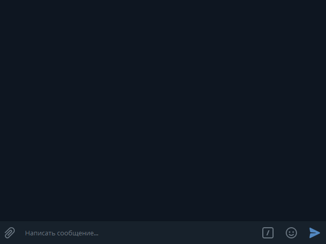
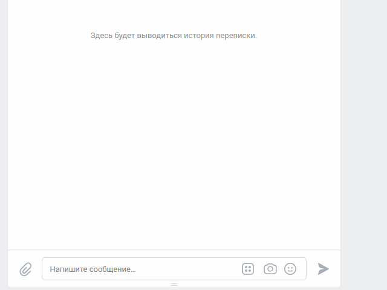

# Бот для проведения викторин

Проект предназначен для проведения викторин с помощью ботов.

Поддерживаемы платформы:
* Вконтакте
* Telegram

### Пример работы ботов

Telegram



Вконтакте



### Как установить

1. Python3 должен быть уже установлен.  

2. Используйте `pip` (или `pip3`, есть конфликт с Python2) для установки зависимостей:
```
pip install -r requirements.txt
```
3. Рекомендуется использовать [virtualenv/venv](https://docs.python.org/3/library/venv.html) для изоляции проекта.

4. Для работы с Api Вконтакте требуется получить токен группы (вкладка "Работа с API" в настройках сообщества) и разрешить ему отправку сообщений. Полученный токен в `.env` под именем `VK_GROUP_MESSAGE_TOKEN`.

5. В настройках группы вкладка `Сообщения` -> `Настройки для бота` разрешить возможности ботов.

6. Для работы с Telegram потребуется:
    * Включить `VPN`, если мессенджер заблокирован в вашей стране; 
    * Получить `bot token` и положить его в `.env` под именем `TG_BOT_TOKEN`, об этом [здесь](https://smmplanner.com/blog/otlozhennyj-posting-v-telegram/);
    * Получить `bot token` для бота-логера, требуемого для отслеживания ошибок в работе ботов. Полученный token в `.env` под именем `TG_LOG_BOT_TOKEN`.
    * Получить свой `id` у `@userinfobot` и положить в `.env` под именем `TG_CHAT_ID`

7. Завести бесплатную базу данных на [redislabs.com](https://redislabs.com/), получить адрес, порт и пароль от базы и положить их в `.env` под именами `DB_HOST`, `DB_PORT` и `DB_PASSWORD` соответственно.

8. Создать текстовый файл с вопросами и ответами викторины. Образец лежит в репозитории под именем `quiz_example.txt` (кодировка `UTF-8`). В файле `.env` записать путь к файлу и его кодировку под именами `QUIZ_PATH` и `QUIZ_TEXT_ENCODING`, соответственно. По умолчанию стоит кодировка `KOI8-R`. Номера вопросов могут быть любыми от 0 до 99.

9. Запустить файлы `vk_bot.py` и `tg_bot.py`.

### Цель проекта

Код написан в образовательных целях на онлайн-курсе для веб-разработчиков [dvmn.org](https://dvmn.org/).
